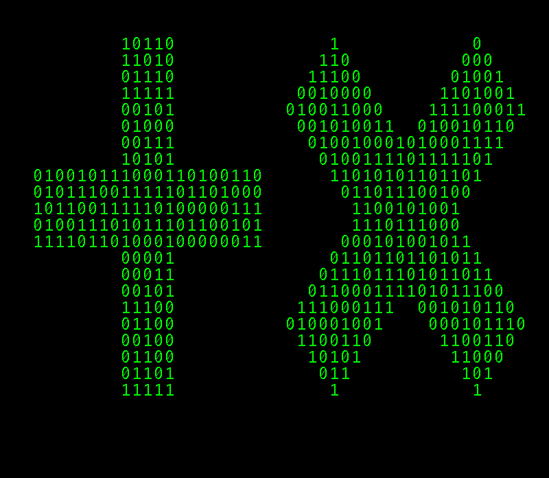

# HackerFX
recreate a bitmap image using zeroes and ones

From

to


This is a small script that reads from a specified bitmap image and writes a zero or one depending on whether the pixel is black or white. 

## Installation
Packaging is currently a Work in progress. The best way to run this as of now is to download and compile HackerFX.java

## Usage
```
Usage: 
  hackerfx -i IN_FILE [-o OUT_FILE] [-s FONT_SIZE] [-f FG_COLOUR] [-b BG_COLOUR]
  hackerfx -h | --help
  hackerfx -v | -version

Options:
  -i IN_FILE    input file name
  -o OUT_FILE   output file name [default: hackerfx_img.png]
  -s FONT_SIZE  font size in pixels [default: 24]
  -f FG_COLOUR  font colour in hex without alpha (eg. #33DD29) [default: #00FF00]
  -b BG_COLOUR  background colour in hex without alpha (eg. #33DD29) [default: #000000]
  -h --help     show this information
  -v --version  show version information
```

## Changelog
29 Jan 2018 -  Added command line arguments 

## Improvements
Improvements are tracked through the issues section. Have a suggestion for an improvement? Post an issue!
